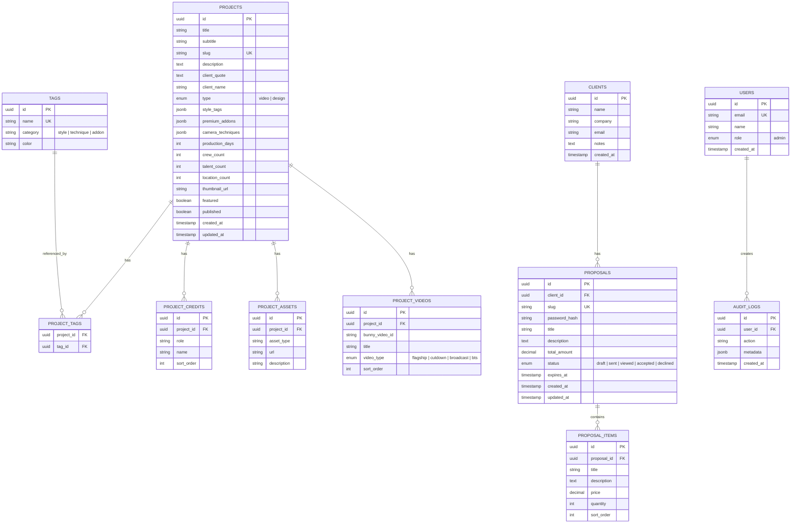

# FNA.WTF Website Rebuild - Comprehensive Plan

**Created**: 2026-02-15 10:50 PST  

**Project**: Friends 'n Allies Agency Portfolio Website  

**Tech Stack**: Next.js 14+, TypeScript, Tailwind CSS, Supabase, GSAP, Bunny CDN, Cal.com, Vercel

---

## Executive Summary

Build a modern, database-driven portfolio website for https://fna.wtf featuring:

- Video production portfolio with filtering/sorting
- Web design portfolio (new)
- Services and transparent pricing pages
- Interactive pricing calculators
- Admin dashboard with CMS and proposal generator
- Password-protected client proposal pages (`/p/{client_name}`)
- Dark theme with GSAP/Motion animations
- Mobile-first responsive design

---

## Scraped Data Summary

### Source: https://fna.wtf

**Homepage Portfolio Projects (27+ items**

**Portfolio Item Data Model** (from /tidbyt-gen2):

- Title, subtitle, client quote
- Assets delivered (Flagship, Cutdowns, Broadcast, Long-form, Photography, BTS, Stills)
- Project description
- Style tags: Video Essay, Founder Story, Commercial, Comedy, etc.
- Premium Add-ons: Motion Graphics, Premium Lighting, Visual FX, Animation
- Camera Techniques: Tripod, Gimbal, Drone, Slider, Long Takes
- Production Scope: # of days, # of crew, # of talent, # of locations
- Complete credits: Director, D.P., Gaffer, Grip, PA, Cast, etc.
- Video embed with analytics

**Services/Pricing Tiers** (from /launch):

**Team** (from /contact):

- Ol' Richie - Managing Partner & Director
- Ready - Managing Partner & Editor

---

## System Architecture

```mermaid
graph TB
    subgraph Public Site
        HOME[Home - Portfolio Grid]
        WORK[/work - Video Portfolio]
        WORKID[/work/id - Project Detail]
        SERVICES[/services - Services Page]
        PRICING[/pricing - Interactive Calculators]
        ABOUT[/about - Team & Contact]
        PROPOSAL[/p/client-name - Password Protected]
    end

    subgraph Admin Dashboard
        LOGIN[/admin/login]
        DASH[/admin - Dashboard]
        CMS[/admin/portfolio - CMS]
        PROPOSALS[/admin/proposals - Generator]
        CLIENTS[/admin/clients - Management]
        ANALYTICS[/admin/analytics]
    end

    subgraph External Services
        SUPABASE[(Supabase DB + Auth)]
        BUNNY[Bunny CDN Videos]
        CALCOM[Cal.com Booking]
        VERCEL[Vercel Hosting]
    end

    HOME --> SUPABASE
    WORKID --> BUNNY
    LOGIN --> SUPABASE
    ABOUT --> CALCOM
    DASH --> SUPABASE
```

---

## Database Schema



---

## Project Structure

```
fnawtf-2026/
├── AGENTS.md                    # Agent coordination file
├── README.md                    # Project documentation
├── .env.example                 # Environment variables template
├── .env.local                   # Local environment (gitignored)
│
├── _plans/                      # Planning documents
│   └── 260215-1050-fna-wtf-website-rebuild.md
│
├── assets/                      # Static assets and data
│   ├── osmo_assets.md          # osmo.supply animation library
│   ├── portfolio-data.csv      # Scraped portfolio data
│   └── images/                 # Local images
│
├── src/
│   ├── app/                    # Next.js App Router
│   │   ├── layout.tsx          # Root layout with dark theme
│   │   ├── page.tsx            # Home/portfolio grid
│   │   ├── globals.css         # Global styles + Tailwind
│   │   │
│   │   ├── work/               # Video portfolio
│   │   │   ├── page.tsx        # Portfolio listing with filters
│   │   │   └── [slug]/
│   │   │       └── page.tsx    # Project detail
│   │   │
│   │   ├── design/             # Web design portfolio
│   │   │   ├── page.tsx
│   │   │   └── [slug]/
│   │   │       └── page.tsx
│   │   │
│   │   ├── services/
│   │   │   └── page.tsx        # Services overview
│   │   │
│   │   ├── pricing/
│   │   │   └── page.tsx        # Interactive calculators
│   │   │
│   │   ├── about/
│   │   │   └── page.tsx        # Team + Cal.com embed
│   │   │
│   │   ├── p/                  # Client proposals
│   │   │   └── [slug]/
│   │   │       └── page.tsx    # Password-protected proposal
│   │   │
│   │   ├── (admin)/            # Admin route group
│   │   │   ├── layout.tsx      # Admin layout with auth
│   │   │   ├── admin/
│   │   │   │   ├── page.tsx    # Dashboard
│   │   │   │   ├── portfolio/
│   │   │   │   │   ├── page.tsx        # CMS listing
│   │   │   │   │   ├── new/
│   │   │   │   │   │   └── page.tsx    # Create project
│   │   │   │   │   └── [id]/
│   │   │   │   │       └── edit/
│   │   │   │   │           └── page.tsx # Edit project
│   │   │   │   ├── proposals/
│   │   │   │   │   ├── page.tsx
│   │   │   │   │   ├── new/
│   │   │   │   │   │   └── page.tsx
│   │   │   │   │   └── [id]/
│   │   │   │   │       └── page.tsx
│   │   │   │   ├── clients/
│   │   │   │   │   └── page.tsx
│   │   │   │   └── analytics/
│   │   │   │       └── page.tsx
│   │   │   └── login/
│   │   │       └── page.tsx
│   │   │
│   │   └── api/                # API routes
│   │       ├── auth/
│   │       │   └── callback/
│   │       │       └── route.ts
│   │       ├── projects/
│   │       │   └── route.ts
│   │       ├── proposals/
│   │       │   ├── route.ts
│   │       │   └── [id]/
│   │       │       └── verify/
│   │       │           └── route.ts
│   │       └── analytics/
│   │           └── route.ts
│   │
│   ├── components/
│   │   ├── ui/                 # shadcn/ui components
│   │   │   ├── button.tsx
│   │   │   ├── card.tsx
│   │   │   ├── input.tsx
│   │   │   └── ...
│   │   │
│   │   ├── layout/             # Layout components
│   │   │   ├── Header.tsx
│   │   │   ├── Footer.tsx
│   │   │   ├── Navigation.tsx
│   │   │   └── AdminSidebar.tsx
│   │   │
│   │   ├── portfolio/          # Portfolio components
│   │   │   ├── PortfolioGrid.tsx
│   │   │   ├── PortfolioCard.tsx
│   │   │   ├── PortfolioFilters.tsx
│   │   │   ├── ProjectDetail.tsx
│   │   │   ├── VideoPlayer.tsx
│   │   │   └── CreditsSection.tsx
│   │   │
│   │   ├── pricing/            # Pricing components
│   │   │   ├── PricingCalculator.tsx
│   │   │   ├── ServiceTierCard.tsx
│   │   │   └── AddOnSelector.tsx
│   │   │
│   │   ├── proposals/          # Proposal components
│   │   │   ├── ProposalViewer.tsx
│   │   │   ├── PasswordGate.tsx
│   │   │   └── ProposalItem.tsx
│   │   │
│   │   ├── admin/              # Admin components
│   │   │   ├── Dashboard.tsx
│   │   │   ├── ProjectForm.tsx
│   │   │   ├── ProposalBuilder.tsx
│   │   │   └── ClientList.tsx
│   │   │
│   │   └── animations/         # Animation components
│   │       ├── TextReveal.tsx
│   │       ├── PageTransition.tsx
│   │       ├── ScrollTrigger.tsx
│   │       └── HoverEffect.tsx
│   │
│   ├── lib/                    # Utilities
│   │   ├── supabase/
│   │   │   ├── client.ts       # Browser client
│   │   │   ├── server.ts       # Server client
│   │   │   └── middleware.ts   # Auth middleware
│   │   │
│   │   ├── bunny/
│   │   │   └── client.ts       # Bunny CDN integration
│   │   │
│   │   ├── animations/
│   │   │   ├── gsap-setup.ts   # GSAP registration
│   │   │   └── motion-config.ts # Motion library config
│   │   │
│   │   └── utils/
│   │       ├── formatters.ts
│   │       └── validators.ts
│   │
│   ├── hooks/                  # Custom hooks
│   │   ├── useAuth.ts
│   │   ├── useProjects.ts
│   │   ├── useAnimations.ts
│   │   └── useVideoPlayer.ts
│   │
│   └── types/                  # TypeScript types
│       ├── database.types.ts   # Supabase generated types
│       ├── project.ts
│       ├── proposal.ts
│       └── api.ts
│
├── public/
│   ├── fonts/                  # Custom fonts
│   │   ├── Manrope/
│   │   ├── SpaceGrotesk/
│   │   └── SpaceMono/
│   └── images/
│
├── supabase/
│   ├── migrations/             # Database migrations
│   │   └── 001_initial_schema.sql
│   └── seed.sql                # Seed data from scraped content
│
└── config files...
    ├── next.config.ts
    ├── tailwind.config.ts
    ├── tsconfig.json
    ├── package.json
    └── .kilocode/rules/        # Existing rules (keep updated)
```

---

## Parallel Workstreams

The project is organized into **6 parallel workstreams** that can be worked on by independent agents. Each workstream has clear dependencies and deliverables.

### Workstream 1: Foundation & Infrastructure

**Dependencies**: None (start first)

**Agent Focus**: Project setup, database, auth

1. Initialize Next.js 14+ project with TypeScript
2. Configure Tailwind CSS with dark theme defaults
3. Install and configure shadcn/ui
4. Create Supabase project and configure environment
5. Create database schema migrations
6. Seed database with scraped portfolio data
7. Configure Supabase Auth with email/password
8. Create auth middleware for admin routes
9. Set up Vercel project and deployment pipeline
10. Create AGENTS.md coordination file

### Workstream 2: Design System & Animations

**Dependencies**: Workstream 1 (project initialized)

**Agent Focus**: UI/UX, animations, theming

1. Configure dark theme color palette in Tailwind
2. Set up custom fonts (Manrope, Space Grotesk, Space Mono)
3. Create base layout components (Header, Footer, Navigation)
4. Integrate osmo.supply animation library from assets/osmo_assets.md
5. Configure GSAP with ScrollTrigger
6. Create reusable animation components (TextReveal, PageTransition)
7. Build responsive mobile navigation
8. Implement page transitions
9. Create loading states and skeletons
10. Ensure Vercel Web Interface Guidelines compliance

### Workstream 3: Public Portfolio Pages

**Dependencies**: Workstreams 1 & 2

**Agent Focus**: Public-facing pages, video integration

1. Build home page with portfolio grid
2. Create PortfolioCard with hover animations
3. Implement portfolio filtering and sorting
4. Build /work video portfolio listing page
5. Create video project detail page template
6. Integrate Bunny CDN video player
7. Build /design web design portfolio listing
8. Create design project detail page template
9. Build credits and assets sections
10. Add related projects recommendations

### Workstream 4: Services & Pricing

**Dependencies**: Workstreams 1 & 2

**Agent Focus**: Services, pricing calculators

1. Build /services page with tier cards
2. Create animated service tier components
3. Build /pricing page layout
4. Create interactive pricing calculator component
5. Build add-on selector with live price updates
6. Implement pitch package calculator
7. Create quote summary component
8. Add Cal.com booking integration
9. Build /about team page
10. Add contact form with Supabase

### Workstream 5: Admin Dashboard & CMS

**Dependencies**: Workstream 1 (auth ready)

**Agent Focus**: Admin area, content management

1. Build admin layout with sidebar navigation
2. Create admin dashboard with analytics overview
3. Build portfolio CMS listing page
4. Create project create/edit forms
5. Implement video upload to Bunny CDN
6. Build tag management interface
7. Create credits editor component
8. Implement draft/publish workflow
9. Add bulk actions for projects
10. Create activity audit log viewer

### Workstream 6: Proposals & Client Management

**Dependencies**: Workstreams 1 & 5

**Agent Focus**: Proposal system, client portal

1. Build client management listing page
2. Create client create/edit forms
3. Build proposal builder interface
4. Create proposal item components
5. Implement proposal preview
6. Build password-protected proposal pages (/p/[slug])
7. Create password gate component
8. Add proposal status tracking
9. Implement proposal expiration
10. Build proposal analytics (views, downloads)

---

## Feature Specifications

### Video Player Integration (Bunny CDN)

```typescript
// lib/bunny/client.ts
interface BunnyVideoConfig {
  libraryId: string;
  videoId: string;
  autoplay?: boolean;
  muted?: boolean;
  loop?: boolean;
}

// Components should use Bunny Stream embed
// URL format: https://iframe.mediadelivery.net/embed/{libraryId}/{videoId}
```

### Portfolio Filtering System

Filter options based on scraped data:

- **Style**: Video Essay, Founder Story, Commercial, Comedy, Documentary
- **Premium Add-ons**: Motion Graphics, Premium Lighting, Visual FX, Animation
- **Camera Techniques**: Tripod, Gimbal, Drone, Slider, Long Takes
- **Production Scale**: Small (1-2 days), Medium (3-5 days), Large (6+ days)

### Interactive Pricing Calculator

Calculator inputs:

- Production days (1-3+)
- Type of deliverables
- Premium add-ons (multi-select)
- Rush delivery toggle

Output:

- Estimated range (min-max)
- CTA to book call via Cal.com

### Proposal System

Password protection flow:

1. Client visits /p/{slug}
2. PasswordGate component prompts for password
3. API verifies password hash
4. Success: renders ProposalViewer
5. Track view analytics in Supabase

---

## Animation Library Integration

### osmo.supply Components (from assets/osmo_assets.md)

The osmo.supply library provides:

- Text reveal effects (character-by-character, word-by-word, line-by-line)
- Page transitions (fade, slide, morph)
- Scroll-triggered animations
- Hover effects for cards and buttons

Integration pattern:

```typescript
// src/lib/animations/osmo-setup.ts
// Parse osmo_assets.md and extract:
// 1. Required npm packages
// 2. HTML structure templates
// 3. CSS styles
// 4. JavaScript initialization code

// Create React wrapper components in src/components/{sub-folder-based-on-type}
```

### GSAP Configuration

```typescript
// src/lib/animations/gsap-setup.ts
import { gsap } from 'gsap';
import { ScrollTrigger } from 'gsap/ScrollTrigger';

gsap.registerPlugin(ScrollTrigger);

// Configure defaults for consistency
gsap.defaults({
  ease: 'power2.out',
  duration: 0.6
});
```

---

## Mobile Responsiveness (CRITICAL PRIORITY)

### Breakpoints

- Mobile: < 640px
- Tablet: 640px - 1024px
- Desktop: > 1024px

### Mobile-First Requirements

1. All components must be designed mobile-first
2. Touch targets minimum 44x44px
3. Portfolio grid: 1 column on mobile, 2 on tablet, 3+ on desktop
4. Navigation: hamburger menu on mobile with full-screen overlay
5. Video player: responsive aspect ratio (16:9)
6. Pricing calculator: stacked layout on mobile
7. Admin dashboard: collapsible sidebar on mobile
8. Test on real devices before deployment

---

## Vercel Web Interface Guidelines Checklist

Apply these rules from the scraped guidelines:

### Accessibility

- [ ] Icon-only buttons have `aria-label`
- [ ] Form controls have `<label>` or `aria-label`
- [ ] Interactive elements have keyboard handlers
- [ ] Semantic HTML (`<button>`, `<a>`, etc.)
- [ ] Images have `alt` attributes
- [ ] Headings are hierarchical h1-h6

### Focus States

- [ ] All interactive elements have `focus-visible:ring-*`
- [ ] No `outline-none` without replacement
- [ ] Use `:focus-visible` over `:focus`

### Forms

- [ ] Inputs have `autocomplete` and `name`
- [ ] Correct `type` for inputs
- [ ] Labels are clickable
- [ ] Errors inline next to fields

### Animation

- [ ] Honor `prefers-reduced-motion`
- [ ] Only animate `transform`/`opacity`
- [ ] No `transition: all`
- [ ] Animations are interruptible

### Dark Mode

- [ ] `color-scheme: dark` on `<html>`
- [ ] `<meta name="theme-color">` matches background
- [ ] Native inputs have explicit colors

---

## Environment Variables

```bash
# .env.example

# Supabase
NEXT_PUBLIC_SUPABASE_URL=
NEXT_PUBLIC_SUPABASE_ANON_KEY=
SUPABASE_SERVICE_ROLE_KEY=

# Bunny CDN
BUNNY_API_KEY=
BUNNY_LIBRARY_ID=
BUNNY_CDN_HOSTNAME=

# Cal.com
NEXT_PUBLIC_CALCOM_USERNAME=

# Vercel
VERCEL_URL=

# App
NEXT_PUBLIC_SITE_URL=https://fna.wtf
```

---

## Success Criteria

1. **Performance**: Lighthouse score > 90 on all categories
2. **Mobile**: Fully functional on iPhone SE through iPad Pro
3. **Accessibility**: WCAG 2.1 AA compliant
4. **SEO**: All pages have proper meta tags, OG images
5. **Admin**: Two users can manage all content
6. **Analytics**: Track video plays, proposal views, page visits

---

## Next Steps

After plan approval:

1. Switch to Code mode to initialize project
2. Begin Workstream 1 (Foundation)
3. Parallel agents can start Workstreams 2-6 as dependencies resolve
4. Regular sync via AGENTS.md
5. Continuous deployment to Vercel preview branches