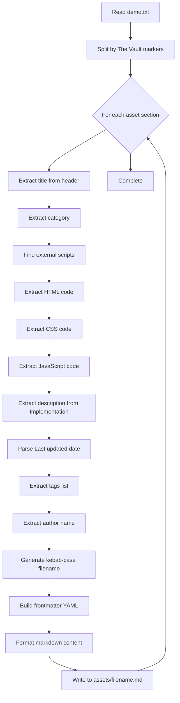

# Osmo Supply Asset Extraction Plan

**Created**: 2026-02-15 11:07 PST  
**Status**: Planning  
**Source**: https://osmo.supply

---

## Overview

This plan outlines a systematic approach for extracting animation code assets from Osmo Supply's "The Vault" website and storing them as individual, well-structured markdown files with YAML frontmatter metadata.

### Goals

1. Convert raw copy/pasted text from Osmo Supply into structured markdown files
2. Each asset gets its own file with proper frontmatter metadata
3. Code blocks are labeled by language (HTML, CSS, JavaScript)
4. Files are named using kebab-case derived from the asset title
5. All files stored in `/assets/` directory

---

## Input Format Analysis

The raw copy/paste from Osmo Supply follows a predictable structure:

```
The Vault
[Category name]
[Asset Title]
[Asset Title repeated 1-2 more times]
Documentation

Setup: External Scripts

Copy
[Script tags - CDN URLs]
Step 1: Add HTML

Copy
[HTML code]
Step 2: Add CSS

Copy
[CSS code]
Step 3: Add Javascript

Copy
[JavaScript code]
Implementation
[Implementation notes and documentation]

Available attributes
[Attribute documentation]

Related resources
[Links to related assets]

Resource details

Last updated

[Date like "February 12, 2026"]

Category

[Category name]

Need help?

Join Slack

[Tag 1]
[Tag 2]
[Tag 3]
...
[Author First Name]
[Author Last Name]
```

### Key Markers for Parsing

| Marker | Meaning |
|--------|---------|
| `The Vault` followed by category | Start of new asset section |
| `Setup: External Scripts` | External CDN dependencies follow |
| `Step 1: Add HTML` | HTML code block follows |
| `Step 2: Add CSS` | CSS code block follows |
| `Step 3: Add Javascript` | JavaScript code block follows |
| `Implementation` | Documentation/description section |
| `Last updated` | Date metadata follows |
| `Category` | Category metadata follows |
| Lines after `Join Slack` until author name | Tags list |
| Two consecutive capitalized names at end | Author name |

---

## Output Format

### File Naming Convention

Convert title to kebab-case:
- "404 Error Minigame" → `404-error-minigame.md`
- "Masked Text Reveal (GSAP SplitText)" → `masked-text-reveal-gsap-splittext.md`
- "Elements Reveal on Scroll" → `elements-reveal-on-scroll.md`

### Frontmatter Schema

```yaml
---
title: "Asset Title"
category: "Category Name"
tags:
  - "Tag1"
  - "Tag2"
  - "Tag3"
author: "First Last"
lastUpdated: "YYYY-MM-DD"
externalScripts:
  - "https://cdn.jsdelivr.net/npm/gsap@3.13.0/dist/gsap.min.js"
  - "https://cdn.jsdelivr.net/npm/gsap@3.13.0/dist/ScrollTrigger.min.js"
source: "https://osmo.supply"
---
```

### Content Structure

```markdown
---
[frontmatter]
---

Brief description extracted from the Implementation section.

## External Scripts

List of CDN script tags required for this animation.

## HTML

```html
[HTML code]
```

## CSS

```css
[CSS code]
```

## JavaScript

```javascript
[JavaScript code]
```

## Implementation Notes

[Documentation extracted from Implementation section]

## Attributes

[Any data-attribute documentation if present]
```

---

## Extraction Algorithm

### Step 1: Identify Asset Boundaries

Each asset in the raw text starts with:
```
The Vault
[Category]
[Title]
```

And ends when the next `The Vault` marker appears or the file ends.

### Step 2: Extract Metadata

1. **Title**: First unique line after category name
2. **Category**: Line immediately after `The Vault` or from `Category` section near end
3. **Last Updated**: Parse date after `Last updated` marker, convert to ISO format `YYYY-MM-DD`
4. **Tags**: Lines between `Join Slack` and the author name at the end
5. **Author**: Last two capitalized words at the very end of the asset section

### Step 3: Extract Code Blocks

#### External Scripts
- Look for `<script src="...">` tags after `Setup: External Scripts`
- Extract the `src` URLs for the frontmatter array
- Keep the full script tags for the External Scripts section

#### HTML Code
- Content between `Step 1: Add HTML` and `Step 2: Add CSS`
- Skip the `Copy` marker
- May contain extensive SVG code

#### CSS Code
- Content between `Step 2: Add CSS` and `Step 3: Add Javascript`
- Skip the `Copy` marker

#### JavaScript Code
- Content between `Step 3: Add Javascript` and `Implementation`
- Skip the `Copy` marker

### Step 4: Extract Description

- Content from `Implementation` section
- Use the first paragraph as a brief description
- Optionally include additional documentation in Implementation Notes section

### Step 5: Generate Output File

1. Create kebab-case filename from title
2. Build YAML frontmatter with extracted metadata
3. Format content sections with proper markdown headers
4. Write to `/assets/[filename].md`

---

## Edge Cases to Handle

### Missing Sections

- Some assets may not have CSS (rare)
- Some may not have HTML (utility scripts)
- Handle gracefully by omitting empty sections

### Multi-Line SVG in HTML

- SVG elements can be very large (100+ lines)
- Keep them inline in the HTML code block
- Do not truncate or modify

### Date Parsing

Convert various date formats to ISO:
- "February 12, 2026" → "2026-02-12"
- "January 5, 2026" → "2026-01-05"

### Tags Extraction

Tags appear as single words or short phrases, one per line:
```
Minigame
404 Error
Draggable
Inertia
GSAP
Advanced
```

Stop when you hit the author name pattern (two consecutive capitalized names).

### Author Name Detection

Author name appears at the very end as:
```
Dennis Snellenberg
Dennis Snellenberg
```
or
```
Ilja van Eck
Ilja van Eck
```

The name is often repeated twice. Capture just one instance.
Handle multi-part names like "van Eck" by checking for capitalization patterns.

---

## Processing Workflow



---

## Example Transformation

### Input (abbreviated)

```
The Vault
Gimmicks
404 Error Minigame
404 Error Minigame
404 Error Minigame
Documentation

Setup: External Scripts

Copy
<script src="https://cdn.jsdelivr.net/npm/gsap@3.13.0/dist/gsap.min.js"></script>
<script src="https://cdn.jsdelivr.net/npm/gsap@3.13.0/dist/Draggable.min.js"></script>
Step 1: Add HTML

Copy
<section data-minigame-init="" class="minigame">
  ...
</section>
Step 2: Add CSS

Copy
.minigame {
  color: #242519;
  ...
}
Step 3: Add Javascript

Copy
gsap.registerPlugin(Draggable, InertiaPlugin, Physics2DPlugin);
...
Implementation
Customization...

Last updated

February 12, 2026

Category

Gimmicks

Need help?

Join Slack

Minigame
404 Error
Draggable
Inertia
GSAP
Advanced
Dennis Snellenberg
Dennis Snellenberg
```

### Output: `assets/404-error-minigame.md`

```markdown
---
title: "404 Error Minigame"
category: "Gimmicks"
tags:
  - "Minigame"
  - "404 Error"
  - "Draggable"
  - "Inertia"
  - "GSAP"
  - "Advanced"
author: "Dennis Snellenberg"
lastUpdated: "2026-02-12"
externalScripts:
  - "https://cdn.jsdelivr.net/npm/gsap@3.13.0/dist/gsap.min.js"
  - "https://cdn.jsdelivr.net/npm/gsap@3.13.0/dist/Draggable.min.js"
  - "https://cdn.jsdelivr.net/npm/gsap@3.13.0/dist/InertiaPlugin.min.js"
  - "https://cdn.jsdelivr.net/npm/gsap@3.13.0/dist/Physics2DPlugin.min.js"
source: "https://osmo.supply"
---

Interactive 404 error page featuring a draggable rocket launcher minigame. Users pull back a rocket and launch it to hit targets scattered across the page.

## External Scripts

```html
<script src="https://cdn.jsdelivr.net/npm/gsap@3.13.0/dist/gsap.min.js"></script>
<script src="https://cdn.jsdelivr.net/npm/gsap@3.13.0/dist/Draggable.min.js"></script>
<script src="https://cdn.jsdelivr.net/npm/gsap@3.13.0/dist/InertiaPlugin.min.js"></script>
<script src="https://cdn.jsdelivr.net/npm/gsap@3.13.0/dist/Physics2DPlugin.min.js"></script>
```

## HTML

```html
<section data-minigame-init="" class="minigame">
  ...
</section>
```

## CSS

```css
.minigame {
  color: #242519;
  ...
}
```

## JavaScript

```javascript
gsap.registerPlugin(Draggable, InertiaPlugin, Physics2DPlugin);
...
```

## Implementation Notes

Customization notes and implementation details...

## Attributes

- `data-minigame-init` - Marks the root container
- `data-minigame-target` - Any hittable element
- ...
```

---

## Agent Instructions

### For the Coding Agent

1. **Read the raw input file**: `assets/demo.txt`

2. **Parse asset boundaries**: Split the file content by detecting `The Vault` markers followed by category names

3. **For each asset, extract**:
   - Title (first occurrence of the asset name)
   - Category (from header or footer section)
   - External script URLs (parse `<script src="...">` tags)
   - HTML code (between Step 1 and Step 2)
   - CSS code (between Step 2 and Step 3)
   - JavaScript code (between Step 3 and Implementation)
   - Description (first paragraph from Implementation)
   - Last updated date (convert to YYYY-MM-DD)
   - Tags (lines after Join Slack, before author)
   - Author name (last names at end of section)

4. **Generate the output file**:
   - Filename: kebab-case from title
   - Location: `/assets/[filename].md`
   - Include all frontmatter fields
   - Format code blocks with language identifiers

5. **Skip processing**:
   - Navigation/sidebar text (lines like "Buttons", "Cursor Animations" followed by numbers)
   - "Related resources" sections
   - "Need help?" sections

6. **Quality checks**:
   - Ensure all code blocks are properly closed
   - Validate frontmatter YAML syntax
   - Confirm file was created successfully

### Processing Order

Process assets sequentially in the order they appear in the input file. Log each asset title as it's processed for debugging.

---

## Files to Create/Modify

| Action | File Path | Description |
|--------|-----------|-------------|
| READ | `assets/demo.txt` | Raw copy/pasted content from Osmo Supply |
| DELETE | `assets/osmo_assets.md` | Old multi-asset file (after extraction) |
| CREATE | `assets/[kebab-title].md` | Individual asset files (one per asset) |

---

## Validation Checklist

After extraction, verify each output file:

- [ ] Frontmatter is valid YAML
- [ ] Title matches the original asset name
- [ ] Category is correct
- [ ] Tags array is populated
- [ ] Author name is captured
- [ ] Date is in YYYY-MM-DD format
- [ ] External scripts array contains CDN URLs
- [ ] HTML code block is present and labeled
- [ ] CSS code block is present and labeled
- [ ] JavaScript code block is present and labeled
- [ ] File is saved to `/assets/` directory
- [ ] Filename uses kebab-case

---

## Known Categories

Based on Osmo Supply's structure:

- Buttons
- Cursor Animations
- Dropdowns & Information
- Filters & Sorting
- Forms
- Gallery & Images
- Gimmicks
- Hover Interactions
- Loaders
- Navigation
- Page Transitions
- Scroll Animations
- Sections & Layouts
- Sliders & Marquees
- Text Animations
- Utilities & Scripts
- Video & Audio

---

## Next Steps

1. User populates `assets/demo.txt` with all assets to extract
2. Switch to Code mode
3. Coding agent reads this plan and executes extraction
4. Review generated files for accuracy
5. Delete old `assets/osmo_assets.md` after verification
