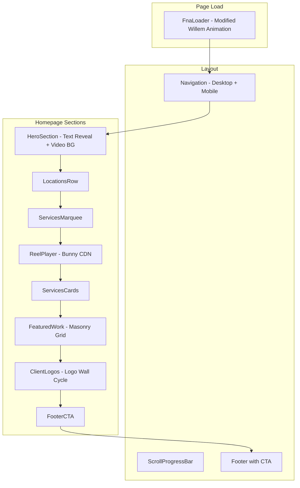

# FNA.WTF Homepage Implementation Plan

**Created**: 2026-02-15 14:15 PST  

**Project**: Friends 'n Allies Agency Portfolio Website - Homepage  

**Tech Stack**: Next.js 14+, TypeScript, Tailwind CSS, Supabase, GSAP 3.13.0, Barba.js, Bunny CDN

---

## Design System Overview

### Color Palette (Purple Hues Based on #a14dfd)

```css
/* CSS Variables */
:root {
  /* Primary Purple Palette */
  --purple-50: #f5f0ff;
  --purple-100: #ede5ff;
  --purple-200: #dcd0ff;
  --purple-300: #c4a8ff;
  --purple-400: #a14dfd;  /* PRIMARY */
  --purple-500: #8b3de8;
  --purple-600: #7a2fd4;
  --purple-700: #6622b6;
  --purple-800: #561d94;
  --purple-900: #471976;
  
  /* Dark Theme */
  --background: #0a0a0b;
  --foreground: #fafafa;
  --muted: #171717;
  --muted-foreground: #a1a1aa;
  --border: #262626;
  --accent: #a14dfd;
  --accent-foreground: #ffffff;
}
```

### Typography

```css
/* Font Families */
--font-display: 'Space Grotesk', sans-serif;  /* Headings, nav */
--font-body: 'Manrope', sans-serif;           /* Body text */
--font-mono: 'Space Mono', monospace;         /* Code, special text */
```

---

## Homepage Section Breakdown

### Component Architecture



---

## Section 1: FNA Loader (Modified Willem Animation)

**Use**: [`_assets/willem-loading-animation.md`](_assets/willem-loading-animation.md)

### Modifications Required

1. **Text Change**: Replace default text with "fna.wtf"
2. **Animation Sequence**:

   - Letters "fna.wtf" appear with reveal animation
   - The "." (dot) starts as a small circle
   - Dot animates/expands to become the preview box
   - Preview box scales up to reveal the full site
   - Text "fna.wtf" fades out completely during reveal
   - Only the site content remains visible

### Component: `FnaLoader.tsx`

**Props**:

```typescript
interface FnaLoaderProps {
  onComplete?: () => void;
  previewImageSrc?: string;
}
```

**Key Classes**:

- `.fna-loader` - Main container
- `.fna-loader__letter` - Individual letters
- `.fna-loader__dot` - The animated dot
- `.fna-loader__preview` - Growing preview box
- `.fna-loader__growing-image` - Full-screen reveal

**Data Attributes**:

- `data-fna-loader-init` - Initialize the loader
- `data-fna-letter` - Mark individual letters
- `data-fna-dot` - Mark the dot element

---

## Section 2: Navigation

**Use**: [`_assets/directional-button-hover.md`](_assets/directional-button-hover.md), [`_assets/burger-menu-button.md`](_assets/burger-menu-button.md)

### Desktop Navigation

- Centered layout
- Links: Home | Services | Work | Pricing | About
- Grey background buttons with grey borders with directional fill animation
- White fill on hover with direction detection
- "Let's talk" button on the right is in purple

### Mobile Navigation

- Centered floating hamburger button
- Animated 3-line to X transformation
- Full-screen dropdown overlay
- Links centered vertically, large touch targets

### Component: `Navigation.tsx`

**Props**:

```typescript
interface NavigationProps {
  currentPage?: string;
}
```

**Subcomponents**:

- `NavButton.tsx` - Directional hover button
- `MobileMenu.tsx` - Hamburger + dropdown
- `NavLink.tsx` - Individual nav link with page transition

**Data Attributes**:

- `data-btn-hover` - Directional button hover
- `data-theme="light"` or `data-theme="dark"` - Button theme
- `data-menu-button="burger"` - Mobile hamburger
- `data-page-name` - For page transitions

---

## Section 3: Hero Section

**Reference**: [`_assets/masked-text-reveal-gsap-splittext.md`](_assets/masked-text-reveal-gsap-splittext.md)

### Content

**Headline**: "We craft visual stories for ambitious brands."

**Subheadline**: "Friends n Allies is a boutique agency that helps build brands, launch products, and scale startups."

**Locations tag**: "San Francisco • Los Angeles • Austin • New York • Global"

### Background Video

- Looping video (muted, autoplay)
- Dark overlay (opacity ~60-70%)
- Visible but subdued
- Bunny CDN video ID: a7a33b5c-afea-4623-95e3-d7756fd7985c

### Component: `HeroSection.tsx`

**Props**:

```typescript
interface HeroSectionProps {
  headline: string;
  subheadline: string;
  backgroundVideoSrc: string;
}
```

**Dependencies**:

- GSAP 3.13.0
- SplitText plugin (Club GSAP)

**Implementation Notes**:

- Use SplitText to split text into words/chars
- Animate each char with stagger using masks
- Video plays behind with dark gradient overlay
- Check `prefers-reduced-motion` before animating

### Component: `LocationsRow.tsx`

**Props**:

```typescript
interface LocationsRowProps {
  locations: string[];
}
```

**Styling**:

- Small text, centered
- Muted color (--muted-foreground)
- Apply `data-reveal-group` for scroll animation
- Bullet separator between locations

---

## Section 6: Reel Player

**Reference**: [`_assets/custom-bunny-hls-player-advanced.md`](_assets/custom-bunny-hls-player-advanced.md)

### Component: `ReelPlayer.tsx`

**Props**:

```typescript
interface ReelPlayerProps {
  videoSrc: string; // Bunny CDN HLS playlist URL
  placeholderSrc: string;
  aspectRatio?: string; // default "16/9"
}
```

**Features**:

- HLS.js for video streaming
- Custom controls (play/pause, mute, fullscreen, timeline)
- Lazy loading (data-player-lazy="meta")
- Placeholder image until interaction

**Data Attributes**:

- `data-bunny-player-init` - Initialize player
- `data-player-src` - HLS playlist URL
- `data-player-status` - Player state
- `data-player-control` - Control type (playpause, mute, fullscreen)

---

## Section 7: Services Cards

### Content

Three cards linking to /services:

1. **Build** - Foundation services
2. **Launch** - Launch services  
3. **Scale** - Growth services

### Component: `ServicesCards.tsx`

**Props**:

```typescript
interface ServiceCard {
  title: string;
  description: string;
  href: string;
  icon?: React.ReactNode;
}

interface ServicesCardsProps {
  cards: ServiceCard[];
}
```

**Styling**:

- Bold typography
- Purple accent hover states
- Grid layout (1 col mobile, 3 col desktop)
- Apply `data-reveal-group` with stagger

---

## Section 8: Services Marquee

**Reference**: [`_assets/css-marquee.md`](_assets/css-marquee.md)

### Content

"digital storytelling • branding • video production • pitch videos • launch pages • copywriting • ai integrations • automations"

### Component: `ServicesMarquee.tsx`

**Props**:

```typescript
interface ServicesMarqueeProps {
  items: string[];
  speed?: number; // pixels per second, default 75
}
```

**Implementation**:

- Infinite horizontal scroll
- IntersectionObserver for performance (pause when off-screen)
- CSS animation with JS speed calculation
- Duplicate content for seamless loop

**Data Attributes**:

- `data-css-marquee-init` - Initialize marquee
- `data-css-marquee-list` - Track container
- `data-css-marquee-item` - Individual items

---

## Section 9: Featured Work (Masonry Grid)

**Reference**: [`_assets/play-video-on-hover-lazy.md`](_assets/play-video-on-hover-lazy.md)

### Component: `FeaturedWork.tsx`

**Data Source**: Supabase `projects` table with `featured=true`

**Props**:

```typescript
interface FeaturedProject {
  id: string;
  title: string;
  subtitle: string;
  slug: string;
  thumbnailUrl: string;
  hoverVideoSrc?: string;
}

interface FeaturedWorkProps {
  projects: FeaturedProject[];
}
```

**Subcomponents**:

- `FeaturedWorkCard.tsx` - Individual project card

**Features**:

- Masonry/dynamic grid layout
- Video preview on hover (lazy loaded)
- Text expands on hover
- Link to project detail page
- Apply `data-reveal-group` for scroll animation

**Data Attributes**:

- `data-video-on-hover="not-active"` - Video hover state
- `data-video-src` - Video URL for lazy loading

---

## Section 10: Client Logos

**Reference**: [`_assets/logo-wall-cycle.md`](_assets/logo-wall-cycle.md)

### Component: `ClientLogos.tsx`

**Data Source**: Supabase `clients` table

**Props**:

```typescript
interface Client {
  id: string;
  name: string;
  logoUrl: string; // White PNG on black BG
}

interface ClientLogosProps {
  clients: Client[];
  shuffle?: boolean; // default false
}
```

**Features**:

- Grid of client logos
- Cycling animation (fade in/out rotation)
- ScrollTrigger to start animation on viewport enter

**Data Attributes**:

- `data-logo-wall-cycle-init` - Initialize component
- `data-logo-wall-shuffle` - Enable shuffle
- `data-logo-wall-item` - Individual logo item
- `data-logo-wall-target` - Logo display target

---

## Section 10: Schedule a Call

Header and 

Add via Cal.com MCP a scheduling embed to book an intro call. 

---

## Section 11: Footer

### Component: `FooterCTA.tsx`

- Multi-column layout. Logo on left with "Friends 'n Allies is..." statement
- Nav on the right
- Copyright and privacy policy and terms underneath. 


---

## Global Animation Systems

### Parallax System

**Reference**: [`_assets/global-parallax-setup.md`](_assets/global-parallax-setup.md)

**Component**: `ParallaxProvider.tsx`

**Data Attributes**:

- `data-parallax="trigger"` - Enable parallax on element
- `data-parallax-start` - Y offset start (e.g., "20")
- `data-parallax-end` - Y offset end (e.g., "-20")
- `data-parallax-direction` - "vertical" or "horizontal"
- `data-parallax-scrub` - Scrub value or "true"
- `data-parallax-disable` - Breakpoint to disable

### Scroll Reveal System

**Reference**: [`_assets/elements-reveal-on-scroll.md`](_assets/elements-reveal-on-scroll.md)

**Component**: `ScrollRevealProvider.tsx`

**Data Attributes**:

- `data-reveal-group` - Container for reveal animation
- `data-reveal-group-nested` - Nested reveal group
- `data-stagger` - Stagger timing in ms (default 100)
- `data-distance` - Animation distance (default "2em")
- `data-start` - Trigger start (default "top 80%")

### Scroll Progress Bar

**Reference**: [`_assets/scroll-progress-bar.md`](_assets/scroll-progress-bar.md)

**Component**: `ScrollProgressBar.tsx`

**Location**: Fixed at bottom of viewport

**Styling**: Purple (#a14dfd) progress fill

---

## Page Transitions

**Reference**: [`_assets/page-name-transition-wipe.md`](_assets/page-name-transition-wipe.md)

### Implementation

- Barba.js for page transitions
- Wipe panel animation (purple background)
- Page name label during transition
- GSAP timeline for smooth yPercent animation

**Component**: `PageTransition.tsx`

**Data Attributes**:

- `data-barba="wrapper"` - Barba container
- `data-barba="container"` - Page content
- `data-page-name` - Name to display during transition

---

## File Structure

```
src/
├── app/
│   ├── layout.tsx              # Root layout with providers
│   ├── page.tsx                # Homepage
│   ├── globals.css             # Global styles + CSS variables
│   ├── work/
│   │   └── page.tsx           # Placeholder
│   ├── services/
│   │   └── page.tsx           # Placeholder
│   ├── pricing/
│   │   └── page.tsx           # Placeholder
│   └── about/
│       └── page.tsx           # Placeholder
│
├── components/
│   ├── layout/
│   │   ├── Navigation.tsx
│   │   ├── NavButton.tsx
│   │   ├── MobileMenu.tsx
│   │   ├── Footer.tsx
│   │   └── FooterCTA.tsx
│   │
│   ├── homepage/
│   │   ├── HeroSection.tsx
│   │   ├── LocationsRow.tsx
│   │   ├── ServicesMarquee.tsx
│   │   ├── ReelPlayer.tsx
│   │   ├── ServicesCards.tsx
│   │   ├── FeaturedWork.tsx
│   │   ├── FeaturedWorkCard.tsx
│   │   └── ClientLogos.tsx
│   │
│   ├── animations/
│   │   ├── FnaLoader.tsx
│   │   ├── PageTransition.tsx
│   │   ├── ParallaxProvider.tsx
│   │   ├── ScrollRevealProvider.tsx
│   │   └── ScrollProgressBar.tsx
│   │
│   └── ui/                     # shadcn/ui components
│       └── ...
│
├── lib/
│   ├── animations/
│   │   ├── gsap-setup.ts       # GSAP plugin registration
│   │   ├── parallax.ts         # Parallax utility
│   │   ├── reveal.ts           # Scroll reveal utility
│   │   └── barba-setup.ts      # Barba.js configuration
│   │
│   └── supabase/
│       ├── client.ts
│       └── server.ts
│
├── hooks/
│   ├── useGsap.ts
│   ├── useReducedMotion.ts
│   └── useIntersectionObserver.ts
│
├── types/
│   ├── project.ts
│   └── client.ts
│
└── styles/
    └── fonts.css               # Font imports
```

---

## Supabase Integration Points

### Featured Projects Query

```typescript
const getFeaturedProjects = async () => {
  const supabase = createServerClient();
  const { data, error } = await supabase
    .from('projects')
    .select('id, title, subtitle, slug, thumbnail_url')
    .eq('featured', true)
    .eq('published', true)
    .order('created_at', { ascending: false })
    .limit(6);
  return data;
};
```

### Client Logos Query

```typescript
const getClients = async () => {
  const supabase = createServerClient();
  const { data, error } = await supabase
    .from('clients')
    .select('id, name, logo_url')
    .order('name');
  return data;
};
```

---

## External Dependencies

### GSAP Plugins (from CDN or npm)

```html
<script src="https://cdn.jsdelivr.net/npm/gsap@3.13.0/dist/gsap.min.js"></script>
<script src="https://cdn.jsdelivr.net/npm/gsap@3.13.0/dist/ScrollTrigger.min.js"></script>
<script src="https://cdn.jsdelivr.net/npm/gsap@3.13.0/dist/CustomEase.min.js"></script>
<!-- SplitText requires Club GSAP membership -->
```

### Other Libraries

- `hls.js@1.6.11` - HLS video playback
- `@barba/core` - Page transitions
- `lenis` - Smooth scrolling (optional)

---

## Execution Summary

This plan breaks down into the following implementation phases:

1. **Foundation** - Design system, CSS variables, fonts, GSAP setup
2. **Layout Components** - Navigation, Footer, progress bar
3. **Animation Providers** - Parallax, scroll reveal, page transitions
4. **Loading Animation** - Modified Willem loader for FNA branding
5. **Homepage Sections** - Each section as independent component
6. **Supabase Integration** - Queries for featured work and clients
7. **Polish** - Reduced motion support, mobile optimization, testing

Each component is designed to be:

- Self-contained and reusable
- Server Component where possible (data fetching)
- Client Component only when interactivity required
- Prepped for dynamic data from Supabase